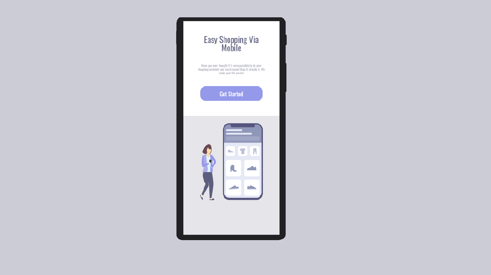
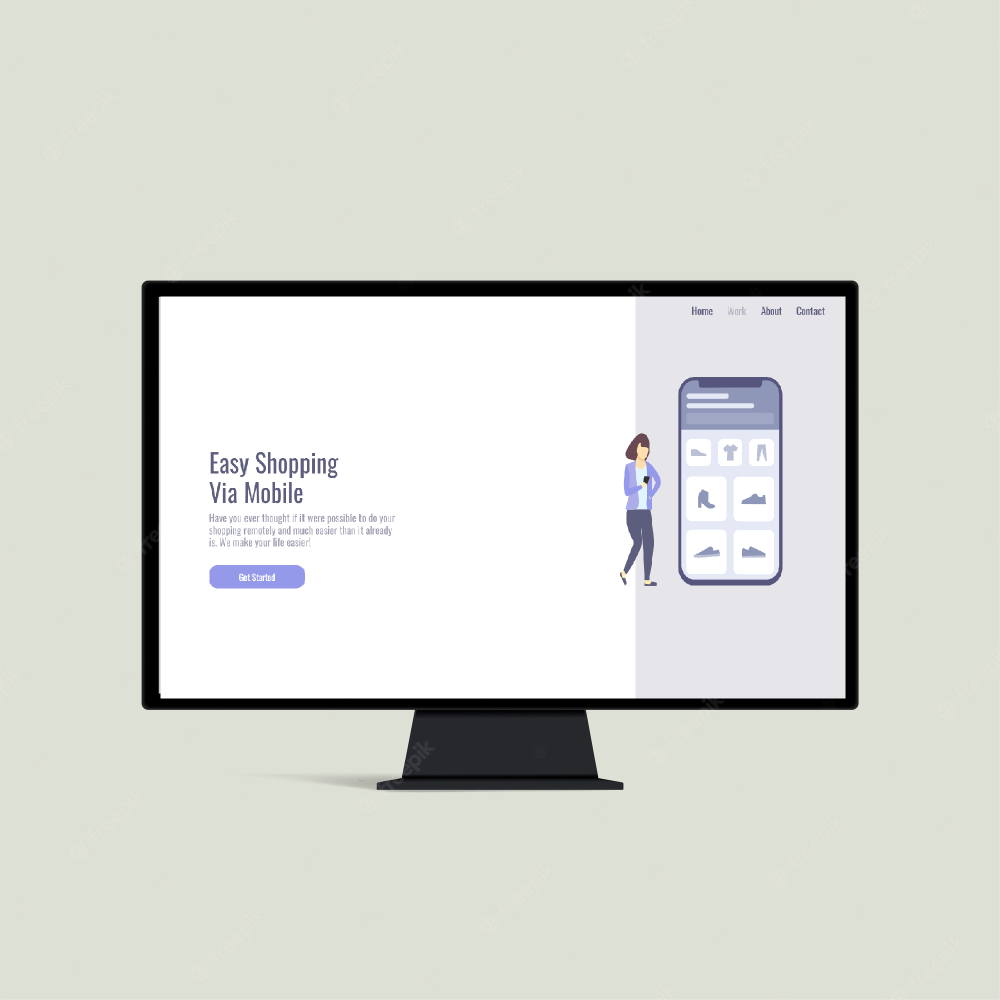

<h1 align="Center"> Shopping </h1>

 
 
<h2>Sobre o que é esse projeto?</h2>
<h3>Esse projeto baseia-se em um desing de interface para um web-app, proposto pelo DEVCLUB.</h3>

<h2>Tecnologias utilizadas:</h2>

<h4> Obs.: Foram utilizados conceitos que garantiram a responsividade. Ex.:FlexBox.</h4>
<h3>Ilustrações do projeto:</h3>

Ilustração da utilização em um dispositivo móvel: 
 
Ilustração da utilização em um dispositivo Desktop:
 

 
 

Para ver o projeto online <a href="" style="tex-decoration:none">clique aqui!</a>

